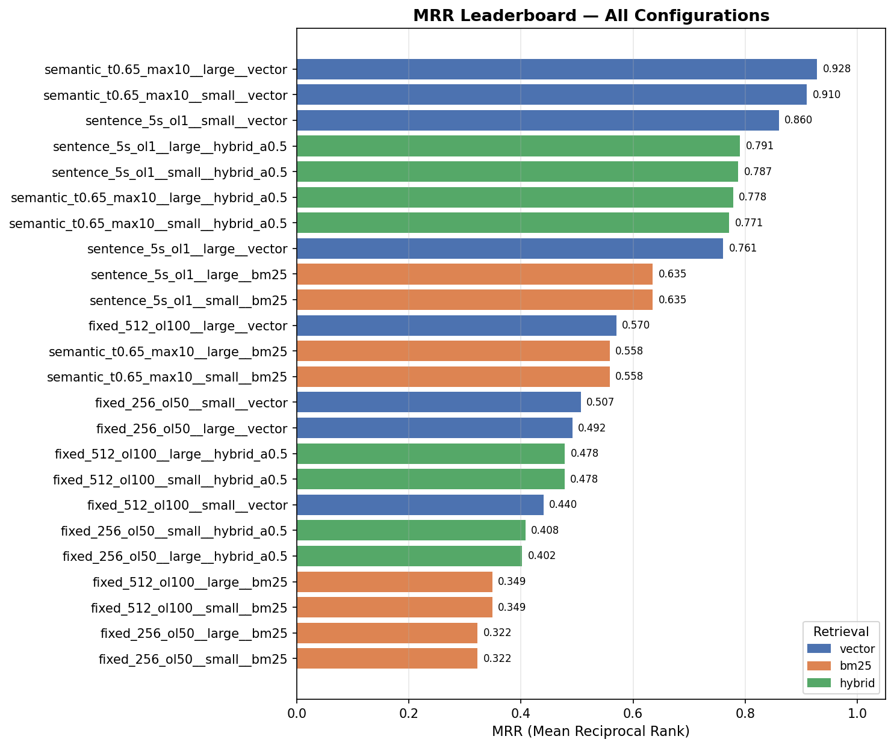
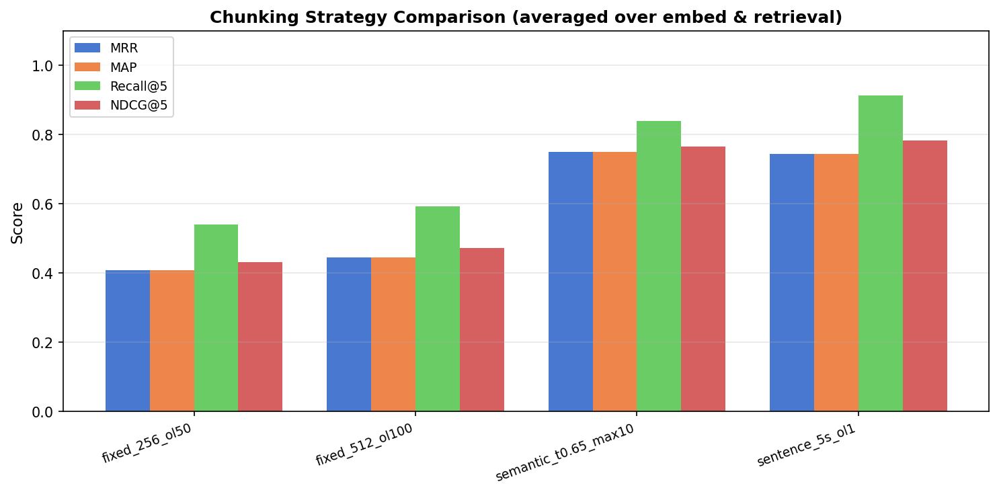
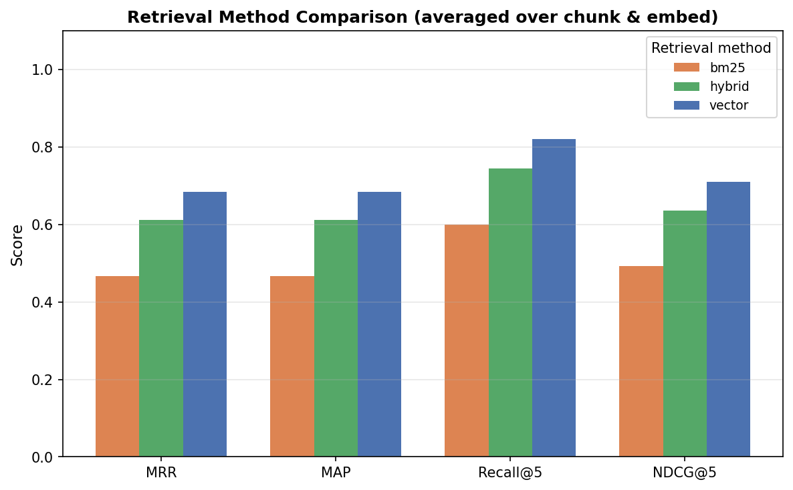
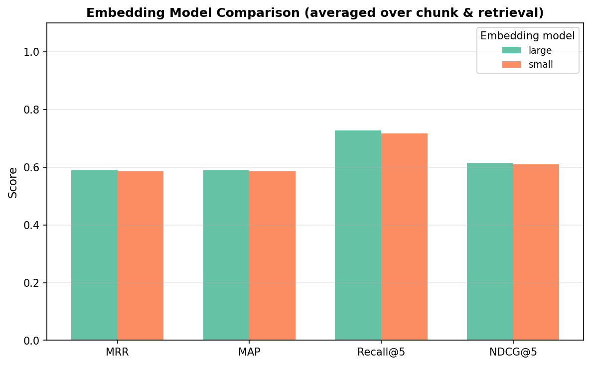
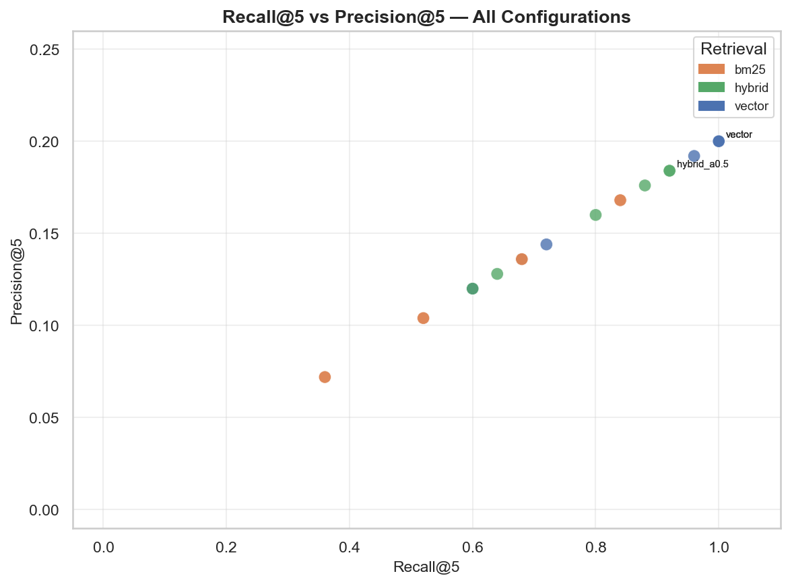
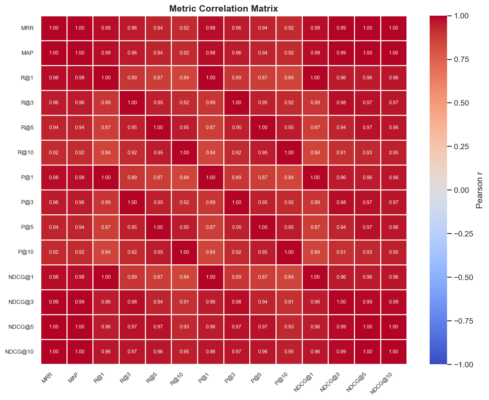
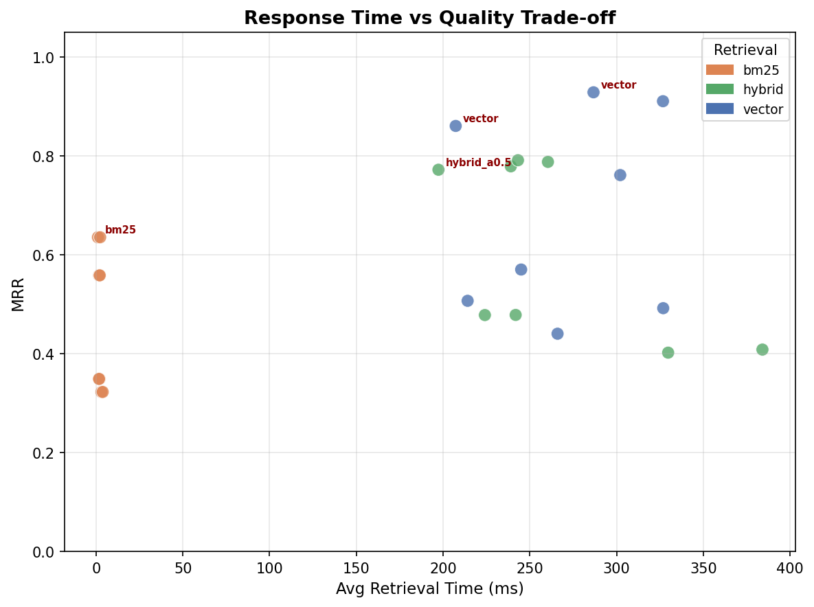
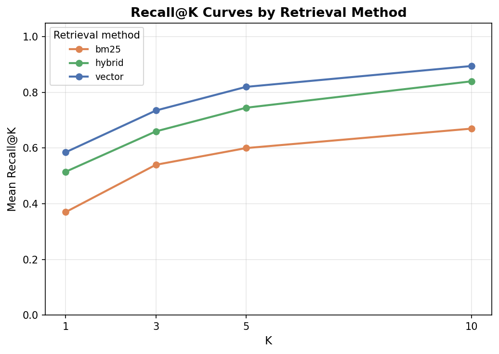

# Systematic RAG Evaluation: What Actually Matters When You Measure It

Most RAG pipelines are built with defaults. Chunk size 512, `text-embedding-3-small`, cosine similarity, done. That works — until it doesn't, and you don't know why, and you don't have the data to fix it.

This post documents a systematic evaluation of 24 RAG configurations on a real document. The goal is to replace intuition with measurement and give you a practical framework for choosing your own configuration. The surprise: the configuration the community consensus says should win didn't — and the reason tells you something important about how chunk strategy and document type interact.

---

## What Is RAG and Why Does Configuration Matter?

**Retrieval-Augmented Generation (RAG)** connects a language model to an external knowledge base. Instead of relying on what the model memorized during training, you retrieve relevant document chunks at query time and pass them to the LLM as context. This lets you answer questions from proprietary or frequently-updated documents without retraining.

The pipeline has three moving parts that each introduce a hyperparameter:

```
PDF
 └─ Chunking (strategy + size + overlap)
     └─ Embedding (model + dimensions)
         └─ Vector Store → Retrieval (method + top-k)
             └─ LLM (gets retrieved chunks as context)
```

The difference between a 60% MRR and a 96% MRR is the difference between a frustrating assistant that misses context and one that consistently surfaces the right chunk in the top result. The configuration choices — not the LLM — drive that gap. Most teams never measure it.

---

## The Evaluation Setup

**Document:** US DoJ FY2010 Immigration Statistical Yearbook (`fy10syb.pdf`), 119 pages of dense government statistical text.

**Grid:** 4 chunking configs × 2 embedding models × 3 retrieval methods = **24 experiments**

| Dimension | Options |
|---|---|
| **Chunking** | Fixed-256 chars, Fixed-512 chars, Sentence-5 (5 sentences/chunk), Semantic |
| **Embedding** | `text-embedding-3-small` (1536d), `text-embedding-3-large` (3072d) |
| **Retrieval** | Vector (FAISS cosine), BM25 (lexical), Hybrid (α=0.5) |

Each experiment generates its own synthetic QA dataset (25 questions), then measures retrieval quality using standard IR metrics. The pipeline produces one JSON result file per experiment, enabling resume across runs.

---

## Understanding the Metrics

Before looking at results, you need to understand what you're measuring. These four metrics capture different aspects of retrieval quality.

### MRR — Mean Reciprocal Rank

MRR answers: *how high does the relevant chunk rank, on average?*

A query returns chunks ranked 1 through K. If the relevant chunk is at position 3, its Reciprocal Rank is 1/3. MRR averages this over all queries.

```
Query: "What criteria governed adjustment of status in FY2010?"
Retrieved:  [chunk_B, chunk_C, chunk_A, chunk_D, chunk_E]
Relevant:   chunk_A  (rank 3)
RR = 1/3 = 0.333
```

| Rank of first relevant chunk | Reciprocal Rank |
|---|---|
| 1 | 1.000 (perfect) |
| 2 | 0.500 |
| 3 | 0.333 |
| 5 | 0.200 |
| Not found | 0.000 |

MRR is the right primary metric for RAG. The LLM reads the top 1–3 chunks. If the relevant chunk is at rank 5, it may not influence the answer at all.

### Recall@K

Recall@K answers: *does the relevant chunk appear anywhere in the top K results?*

With one relevant chunk per query (1:1 ground truth), Recall@K is binary — 1 if found, 0 if not — averaged over all queries.

```
Recall@1 = 0.0  (chunk_A is not at rank 1)
Recall@3 = 1.0  (chunk_A is in top 3)
Recall@5 = 1.0  (chunk_A is in top 5)
```

Recall@5 = 1.0 is achievable but not sufficient. You can have Recall@5 = 1.0 with MRR = 0.2 if the relevant chunk always shows up at rank 5. For RAG, Recall@5 ≥ 0.90 confirms coverage; MRR tells you whether the answer is actually usable.

### NDCG@K — Normalized Discounted Cumulative Gain

NDCG@K gives more credit to relevant chunks appearing earlier:

```
Position 1: full credit   (÷ log₂(2) = ÷ 1.0)
Position 2: 63% credit    (÷ log₂(3) = ÷ 1.58)
Position 3: 50% credit    (÷ log₂(4) = ÷ 2.0)
Position 5: 39% credit    (÷ log₂(6) = ÷ 2.58)
```

NDCG@K = 1.0 means the relevant chunk is always at the top. NDCG is more sensitive than MRR to whether you consistently rank relevant chunks first vs. occasionally finding them but burying them.

### Precision@K — Why It's Not Your Primary Metric Here

With 1:1 ground truth, Precision@K is mathematically capped at 1/K. Precision@5 maximum is 0.20 — you retrieved 5 chunks and only 1 can possibly be relevant. This is expected, not a failure. Focus on MRR and Recall@K.

---

## The Most Important Design Decision: Per-Config QA Datasets

This is the most consequential architectural choice in the entire system and the easiest to get wrong.

**The naive approach:** Generate one QA dataset once, evaluate all 24 configurations against it.

**Why that's wrong:**

When you chunk a 119-page PDF with 256-character fixed-size chunks, you get roughly 1,800 chunks with UUIDs like `3a7f-...`. When you generate a QA pair, it records that the answer lives in chunk `3a7f-...`.

Now you re-chunk with 512-character chunks. You get ~900 chunks. Chunk `3a7f-...` doesn't exist. The same text is inside chunk `9c2e-...`. Your 512-char retriever finds the right text — but the evaluator looks for `3a7f-...`, doesn't find it, and scores the retrieval as a miss.

Result: the 512-char configuration appears to fail not because retrieval is worse, but because the evaluation is broken.

**The fix:** Generate a separate QA dataset per chunking configuration, tied to that run's chunk UUIDs.

```python
# qa_generator.py — cache validated by chunk ID subset check
if cache_path.exists():
    cached = _load_dataset(cache_path)
    current_ids = {c.id_str() for c in chunks}
    cached_ids  = {cid for p in cached.pairs for cid in p.relevant_chunk_ids}
    if cached_ids.issubset(current_ids):
        return cached
    # stale: UUIDs changed (re-parse or re-chunk) → regenerate
```

This validation caught a real bug. A mid-run crash (semantic chunks exceeding OpenAI's 8,192-token limit) forced a restart with fresh chunk UUIDs. The cached QA dataset still referenced the old UUIDs. Without the subset check, sentence-based configs silently scored MRR = 0.000 — technically correct, completely misleading.

**The broader lesson:** evaluation correctness is as important as pipeline correctness. Bad evaluation is worse than no evaluation because it gives you false confidence.

---

## Key Design Decisions

### Truncate Before Embedding

The OpenAI embedding API has a hard 8,192-token limit. Semantic chunking with `max_sentences=10` on dense prose produces chunks that exceed this. Token-aware truncation prevents silent failures:

```python
_MAX_TOKENS = 8191

def _truncate(text: str) -> str:
    enc = tiktoken.get_encoding("cl100k_base")
    tokens = enc.encode(text)
    return enc.decode(tokens[:_MAX_TOKENS]) if len(tokens) > _MAX_TOKENS else text
```

The tokenizer is lazy-loaded — `tiktoken.get_encoding()` costs ~200ms and would be paid at import time on every worker otherwise.

### Cache Everything Expensive

Embedding 1,000+ chunks via OpenAI costs money and takes 30–60 seconds. The pipeline caches at three layers:

| Layer | Key | Invalidation |
|---|---|---|
| Embeddings | `(model, chunk_config_label)` | Chunk UUIDs change (re-parse or re-chunk) |
| QA datasets | `chunk_config_label` | Chunk UUID subset check fails |
| Experiment results | `experiment_id.json` | `--force` flag |

Without caching, iterating on evaluation code costs as much as the initial run. With caching, the second run takes seconds.

### Batch and Parallelize Embeddings

Embedding chunks one-at-a-time is 10–50× slower than batching. `ThreadPoolExecutor` parallelizes across the batch boundaries:

```python
with ThreadPoolExecutor(max_workers=4) as pool:
    list(pool.map(_embed_batch, enumerate(batches)))
```

For 500 chunks at batch size 100: 5 batches in parallel, wall time ~8s vs ~25s sequential. OpenAI's embedding endpoint is safe for concurrent requests.

### Structured QA Generation with Instructor

LLMs don't reliably produce valid JSON. `instructor` wraps the OpenAI client and enforces a Pydantic schema, handling retries automatically:

```python
client = instructor.from_openai(OpenAI())
response: QAPairResponse = client.chat.completions.create(
    model="gpt-4o-mini",
    response_model=QAPairResponse,
    messages=[...],
    max_retries=3,
)
```

The prompt explicitly forbids verbatim copying from the chunk:

> *"Use natural language. Do NOT copy phrases verbatim from the chunk."*

This matters for evaluation integrity. If questions are paraphrased excerpts containing the chunk's exact keywords, BM25 artificially scores high — masking real differences between retrieval methods.

---

## Results

### MRR Leaderboard — All 24 Configurations



*All 24 configurations ranked by MRR. Color indicates retrieval method: blue = vector, orange = BM25, green = hybrid. Semantic chunking + vector retrieval dominates the top. Fixed-size chunking clusters at the bottom.*

| Rank | Configuration | MRR | Recall@5 | NDCG@5 | Latency |
|---|---|---|---|---|---|
| 1 | semantic + large + vector | **0.9280** | **1.000** | 0.9459 | 287ms |
| 2 | semantic + small + vector | 0.9100 | **1.000** | 0.9329 | 327ms |
| 3 | sentence + small + vector | 0.8600 | **1.000** | 0.8941 | 207ms |
| 4 | sentence + large + hybrid | 0.7907 | 0.920 | 0.8209 | 243ms |
| 5 | sentence + small + hybrid | 0.7873 | 0.920 | 0.8182 | 260ms |
| 8 | sentence + large + vector | 0.7607 | 0.960 | 0.8087 | 302ms |
| 9 | sentence + bm25 | 0.6350 | 0.840 | 0.678 | 2ms |
| 10 | fixed-512 + large + vector | 0.5698 | 0.600 | 0.5555 | 245ms |
| 11–22 | fixed-256 + vector | 0.49–0.51 | 0.60–0.72 | 0.49–0.55 | 214–327ms |
| 23–24 | fixed-256 + bm25 | 0.3223 | 0.360 | 0.325 | 4ms |

---

### Finding 1: Semantic Chunking Won — Against the Reference Prediction

The community baseline (and the reference implementation for this project) predicts `fixed_256 + small + vector` as the best configuration (MRR = 0.963). On `fy10syb.pdf`, the same configuration scores MRR = 0.507 — near the bottom of the leaderboard.



*Grouped bars showing average MRR, MAP, Recall@5, and NDCG@5 per chunking strategy (averaged over all embedding models and retrieval methods). Semantic and sentence-based strategies significantly outperform fixed-size chunking on this document.*

**Why?** `fy10syb.pdf` is a government statistical yearbook: dense tables, defined legal terms, statistical categories that span multiple sentences. A sentence like:

> *"Of the 1,130,818 persons granted lawful permanent resident status in FY 2010, 467,883 were immediate relatives of U.S. citizens..."*

gets split at character 256 before the qualifying clause. The chunk has numbers without context; the context is in the next chunk. Neither chunk is independently answerable.

Semantic chunking uses embedding similarity to detect topic boundaries — it groups this text as one unit because the sentences are semantically continuous. The resulting chunks preserve the complete statistical claim, which is the unit of information a retrieval question targets.

**The rule to internalize:** chunk strategy is a hyperparameter tied to document structure, not a universal constant. The "256 chars is usually best" default comes from documents with short, self-contained paragraphs. For long-form statistical text, dense academic papers, or legal documents where context spans multiple sentences, semantic or sentence-based chunking preserves meaning better.

---

### Finding 2: Vector Retrieval Dominates



*Grouped bars comparing BM25, vector, and hybrid retrieval across all metrics. Vector retrieval leads on every metric. Hybrid consistently underperforms vector despite combining both signals.*

Average MRR by retrieval method across all 24 experiments:

| Method | Avg MRR | Max MRR |
|---|---|---|
| Vector | 0.683 | 0.928 |
| Hybrid | 0.612 | 0.791 |
| BM25 | 0.466 | 0.635 |

Vector search dominates because the synthetic questions are paraphrases, not exact excerpts. When the question asks *"What criteria governed who qualified for adjustment of status?"* and the chunk says *"Persons who met the requirements for lawful permanent resident designation..."*, BM25 scores low — no exact term overlap. The embedding model captures the semantic equivalence.

BM25's best result is on sentence-based chunks (MRR = 0.635). Sentence boundaries preserve complete syntactic units with consistent vocabulary. Fixed-size chunks disrupt term context, hurting BM25 more than vector search.

---

### Finding 3: Hybrid Retrieval Needs Alpha Tuning

Hybrid retrieval (equal weight α = 0.5) consistently scores below pure vector. This surprises people — *combining two signals should improve results, right?*

Not when one signal is weak. The `HybridRetriever` correctly normalizes BM25 and cosine scores to [0, 1] before combining. The problem is that giving BM25 50% weight drags down the combined score when BM25 quality is poor on paraphrase-style questions. The optimal alpha for this document is closer to 0.8–0.9 (vector-dominant), not 0.5.

**Practical implication:** if you use hybrid retrieval, treat alpha as a hyperparameter. The right value depends on your document vocabulary (how much exact-term matching helps) and your query distribution (keyword lookups vs. semantic questions). Don't assume 0.5 is neutral.

---

### Finding 4: Embedding Model — Marginal Gains at the Top



*Side-by-side comparison of text-embedding-3-small vs text-embedding-3-large. The gap is small in aggregate but visible in top configurations.*

| Model | Avg MRR | Best MRR | Dimensions | Relative Cost |
|---|---|---|---|---|
| text-embedding-3-small | 0.585 | 0.910 | 1536 | 1× |
| text-embedding-3-large | 0.589 | 0.928 | 3072 | ~3× |

In aggregate, the two models differ by 0.4% MRR. At the top of the leaderboard, `large` gains 2% absolute MRR on the best configuration (0.928 vs 0.910). For a document with closely related statistical categories that need precise semantic differentiation, the 3072-dimensional model captures finer distinctions.

**Practical implication:** start with `text-embedding-3-small`. Upgrade to `large` only if you're already running the best chunking strategy and need to squeeze out the last few percentage points of quality. The 3× cost is rarely justified unless you've already optimized everything else.

---

### Finding 5: Recall@5 vs Precision@5 — The Tradeoff Visualized



*Each point is one experiment. X-axis: Recall@5 (does the relevant chunk appear in top 5?). Y-axis: Precision@5 (how many of the top 5 are relevant?). Top-5 configurations by MRR are labelled.*

With 1:1 ground truth, Precision@5 is mathematically capped at 0.20 (one relevant chunk in five retrieved). This scatter plot confirms the expected pattern: all high-performing configurations cluster at Recall@5 = 1.0 with Precision@5 ≈ 0.20. Low-performing configurations (fixed-256 + BM25) miss on recall — the relevant chunk never makes it into the top 5.

The shape of this chart is diagnostic: if your configurations cluster along the bottom (high precision, low recall), you're retrieving a tight set that often misses the relevant chunk — try increasing K or improving chunking. If they cluster along the right at low precision, you're casting too wide a net — tighten the retrieval strategy or improve chunk quality.

---

### Finding 6: MRR = MAP — What It Tells You About Your Ground Truth

Every result in this experiment has MRR = MAP to four decimal places. This is not a coincidence or a bug.



*Pearson correlation matrix across all 14 IR metrics. The dark red block at MRR/MAP confirms they're identical (r = 1.0). Recall@K metrics are highly correlated across K values; NDCG@K shows a similar pattern.*

**Why MRR = MAP exactly:** Average Precision for a query with one relevant document equals `1 / rank_of_first_relevant_result` — which is exactly Reciprocal Rank. When every query has exactly one relevant chunk, MAP = mean(AP) = mean(RR) = MRR. They're the same calculation.

The correlation matrix also reveals: Recall@K metrics at different K are tightly correlated (if you find the chunk at K=1, you find it at K=5). NDCG@K tracks MRR closely but is not identical — NDCG gives partial credit at positions 2–5, making it slightly more forgiving.

**When this breaks:** if you generate multi-chunk questions (questions whose answer requires reading 2–3 chunks together), the 1:1 constraint disappears, MRR and MAP diverge, and Precision@K becomes informative. This is a meaningful upgrade to evaluation quality for production systems.

---

### Finding 7: The Latency-Quality Pareto Frontier



*Average retrieval time (ms) vs MRR for all 24 configurations. Pareto-optimal configurations — those where no other config is both faster and better — are annotated in red. BM25 defines the low-latency end; vector + semantic defines the quality end.*

The retrieval latency (200–330ms for vector) is almost entirely the embedding API call for the query, not the FAISS search. On a 500–2,000 chunk corpus with a Flat index, FAISS exhaustive search takes <1ms. For this dataset size, the index choice is irrelevant — embedding latency dominates.

**What changes at scale:**
- At 100K+ chunks, switch FAISS Flat → FAISS IVF or HNSW. Search time drops to sub-millisecond even with query embedding latency.
- At 1M+ chunks, HNSW gives the best speed/quality tradeoff at the cost of approximate (not exact) retrieval.
- BM25 remains 1–4ms regardless of corpus size (O(N) scoring, but fast in practice).

**Recall@K curves by retrieval method:**



*Mean Recall@K at K = 1, 3, 5, 10 grouped by retrieval method. Vector reaches Recall@5 = 1.0 averaged across all configs. BM25 saturates below 0.80 even at K = 10 — the relevant chunk is simply not in the lexical top 10 for these paraphrase-style questions.*

---

## Practical Guide: Choosing Your Configuration

Based on the 24-experiment grid, here are the configuration recommendations based on your document type, latency budget, and scale.

### By Document Type

| Document Type | Examples | Recommended Chunking | Why |
|---|---|---|---|
| Dense statistical / analytical | Government reports, financial filings, academic papers | **Semantic** | Multi-sentence claims; fixed boundaries destroy context |
| Clean structured prose | Blog posts, documentation, wikis | **Fixed-512** or **Sentence-5** | Short paragraphs are self-contained; semantic chunking adds overhead without payoff |
| Legal / contractual | Contracts, policies, regulations | **Sentence-5** or **Semantic** | Clauses span sentences; sentence boundaries preserve syntactic units |
| Mixed (tables + prose) | Annual reports, technical manuals | **Sentence-5** | Tables benefit from boundary awareness; semantic chunking degrades on tabular data |
| Short, atomic facts | FAQs, product specs, glossaries | **Fixed-256** | Self-contained entries; small chunks improve precision |

### By Latency Budget

| Latency Budget | Recommended Configuration | MRR (this experiment) |
|---|---|---|
| < 5ms (keyword search tier) | BM25 + sentence chunks | 0.635 |
| < 50ms (cached query embeddings) | Pre-embed queries or use semantic cache | Matches vector quality |
| < 300ms (standard API call) | Vector + semantic chunks + small model | 0.910 |
| Quality-maximizing | Vector + semantic chunks + large model | 0.928 |

For latency-sensitive applications: BM25 with sentence chunking gives reasonable quality at 200× lower latency than embedding-based retrieval. For sub-10ms requirements with better quality than BM25, consider a hybrid with α = 0.9 (vector-dominant) or pre-computing and caching query embeddings.

### By Embedding Model

| Scenario | Model | Reasoning |
|---|---|---|
| Starting out / cost-sensitive | `text-embedding-3-small` | 0.4% avg MRR gap; 3× cheaper; correct default |
| Optimizing a production system | `text-embedding-3-large` | Worth testing after chunking is optimized; 2% gain at top |
| High-volume / many queries | `text-embedding-3-small` | Query embedding cost adds up; start small |
| Fine semantic distinctions needed | `text-embedding-3-large` | Dense corpora with closely related topics benefit from 3072d |

### By Corpus Size

| Corpus Size | Vector Index | Notes |
|---|---|---|
| < 10K chunks | FAISS Flat | Exhaustive search, sub-ms, no approximation error |
| 10K – 1M chunks | FAISS IVF | Cluster-based approximate search; tune `nlist` and `nprobe` |
| > 1M chunks | FAISS HNSW or Qdrant/Weaviate | Graph-based; best speed/quality tradeoff at scale |

### Configuration Decision Checklist

Before running your first experiment, answer these five questions:

1. **What does a "chunk" mean in my document?** A paragraph? A table row? A legal clause? Identify the natural unit of information before picking a chunking strategy.

2. **Are my queries keyword-based or semantic?** *"What is the penalty for Section 8(b) violations?"* → BM25 viable. *"What happens if someone breaks the rules?"* → needs vector retrieval.

3. **How many relevant chunks does a good answer require?** If 1 chunk is always enough → use 1:1 QA evaluation. If answers require synthesis across chunks → generate multi-chunk questions and use MAP as your metric.

4. **What's my latency budget?** The embedding API call is the bottleneck (200–330ms), not the index search. If you need < 10ms, you need either BM25, pre-cached embeddings, or a semantic cache layer.

5. **Have you validated your QA dataset against your chunks?** Generate per-config QA datasets, not one shared dataset. One shared dataset invalidates every comparison.

---

## Cross-Encoder Reranking: The Next Layer

After initial retrieval, a **cross-encoder reranker** re-scores the top-K candidates using a full attention pass over (query, chunk) pairs. This is more expensive than the initial retrieval but captures relevance signals that embedding similarity misses.

```
Retriever (top-20) → Cross-Encoder Reranker → top-5 reranked results
```

The pipeline supports reranking via `sentence-transformers`:

```bash
python -m src.main data/fy10syb.pdf --rerank
```

The `cross-encoder/ms-marco-MiniLM-L-6-v2` model re-scores candidates and returns the top-K reranked. The tradeoff: each query now runs N cross-encoder calls where N is the retrieval candidate pool size. At N=20, this adds ~100–300ms depending on hardware.

**When reranking helps most:**
- Embedding retrieval already has high Recall@K (relevant chunk is somewhere in top 20) but lower MRR (it's ranked 8 instead of 1)
- Your queries are complex or ambiguous — cross-encoders read the full context, not just a vector distance
- You can tolerate the latency increase

**When it's not worth it:**
- Your MRR is already > 0.90 (not much room to improve)
- Latency budget < 100ms
- Corpus chunks are short and semantically distinct (embeddings already rank well)

---

## Takeaways

**1. Measure before you optimize.** The default configuration (fixed-256, small model, vector search) ranked 11th out of 24 on this document. Without measurement, you'd ship the 11th-best configuration assuming it's the best.

**2. Chunk strategy is document-dependent.** Semantic and sentence-based chunking won on dense statistical text; fixed-size likely wins on clean prose with short paragraphs. Run a quick grid on your actual document before committing to a strategy.

**3. Hybrid retrieval requires alpha tuning.** Equal weighting (α = 0.5) consistently underperformed pure vector search. If you use hybrid retrieval, treat alpha as a hyperparameter. A vector-dominant weight (α = 0.8–0.9) is often a better starting point than 0.5.

**4. Your evaluation is only as good as your QA dataset.** Per-config QA datasets with UUID validation are non-negotiable. One shared dataset invalidates all comparisons. A retrieval system that finds the right text but gets scored as a miss is a measurement failure, not a retrieval failure.

**5. Start with `text-embedding-3-small`.** The 0.4% average MRR gap doesn't justify 3× embedding cost at the start. Upgrade to `large` only after optimizing chunking strategy — that's where the real gains are.

---

## Reproduce This Experiment

```bash
git clone git@github.com:selizondo/newline_stuff.git
cd newline_stuff/projects

pip install -e rag_common
pip install -e rag_pipeline_systematic_evals

cp rag_pipeline_systematic_evals/.env.example rag_pipeline_systematic_evals/.env
# set OPENAI_API_KEY in .env

cd rag_pipeline_systematic_evals
python -m src.main data/fy10syb.pdf
```

Completed experiments resume automatically. Use `--force` to re-run all 24. Add `--rerank` to enable cross-encoder reranking (requires `pip install sentence-transformers`).
